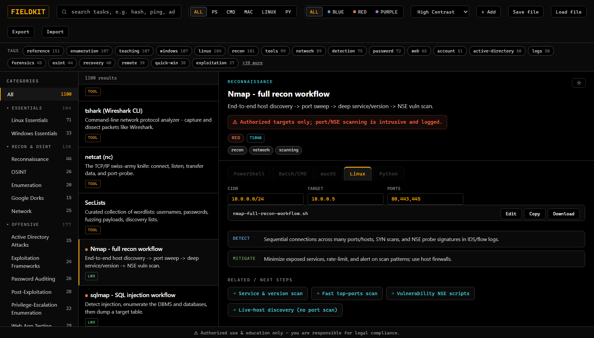

# FieldKit

**An offline, single-file command reference and purple-team learning tool** for blue teams,
red teams, educators, and IT / forensics practitioners. Runs straight from a USB drive — open
`FieldKit.html` in any browser (`file://`), no install, no build, no network.

> **Authorized use & education only. You are responsible for legal compliance.**
> See [DISCLAIMER.md](DISCLAIMER.md).

<!-- Screenshot: drop an image at docs/screenshot.png and it will render here -->
<!--  -->

## What it does

- Searchable library of copy-paste-ready commands across **PowerShell, Windows CMD, macOS
  (BSD), Linux (GNU)**, plus **Python**, **Google dorks**, and **SQL**.
- **Purple-team format:** offensive entries are paired with a MITRE **ATT&CK** id, a
  **Detect** line, and a **Mitigate** line — so defenders can recognize the same activity.
- **Placeholders** — editable `{{TARGET:10.0.0.0/24}}` fields fill live into Copy/Download.
- **Tools catalog** — official link, license, platforms, and per-OS install one-liners (AV/EDR
  like ClamAV & Malwarebytes, ransomware decryptors, forensics/RE suites, remote-access tools, and more).
- **Interactive generators** — built-in widgets such as the **Crontab Generator**: pick a
  preset or set each field, get the cron expression, a plain-English summary, and a
  ready-to-paste `crontab` install line.
- **Filters** — category rail, **team filter** (blue / red / purple), language, full-text
  search, and **context-aware tag chips** (the tag bar shows only the tags present in your
  current view, so it never becomes a wall of 60 chips).
- **Related / next steps** — entries can link to the logical follow-on tasks (e.g. triage
  snapshot → hash processes → persistence sweep), so common workflows chain without leaving
  the detail pane.
- **Color themes** — Field Amber, Night Slate, Paper (light), High-Contrast, and Terminal
  Green, remembered between sessions.
- **Favorites**, keyboard nav (`/` search, ↑/↓ list, `c` copy), and one-click **Copy /
  Download** (works from `file://`).
- **Add / Edit** entries in-app and sync them to a JSON file on the USB.

## Offline usage

Keep `FieldKit.html` **and `.library-data.js` together** (the command library lives in the
`.js`, loaded via `<script src>` so it works from `file://`, where a fetched `.json` would be
blocked). Copy both to a USB drive and open the HTML in a browser. That's it.

> **Note:** `.library-data.js` is a hidden file (leading dot). When copying FieldKit to a USB
> drive or another folder, enable **“show hidden files”** in your file manager so it comes along —
> without it the app opens but shows an empty library.

## Repository layout

| File | Purpose |
|---|---|
| `FieldKit.html` | The app — UI, rendering, filters, editor. Self-contained, no dependencies. |
| `.library-data.js` | The command/tool library (`window.FIELDKIT_LIBRARY`); hidden dotfile. |
| `validate.js` | Schema + vocabulary validator (`node validate.js`); runs in CI. |
| `CONTRIBUTING.md` | Entry schema and how to add one. |
| `DISCLAIMER.md` | Authorized-use notice. |

## Contributing

New entries go in `.library-data.js`; run `node validate.js` (must print `OK`) and open the app
to confirm it renders. See **[CONTRIBUTING.md](CONTRIBUTING.md)** for the schema, the
purple-team content policy, and the macOS-vs-Linux correctness rules.

## License

[MIT](LICENSE) © 2026 Wyatt Rossell.
